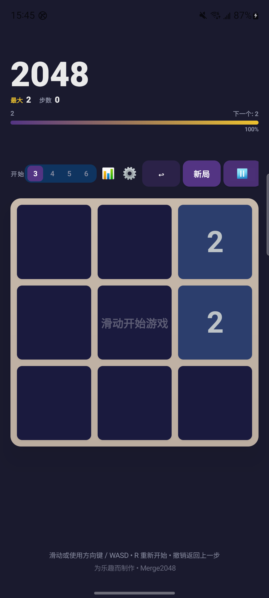
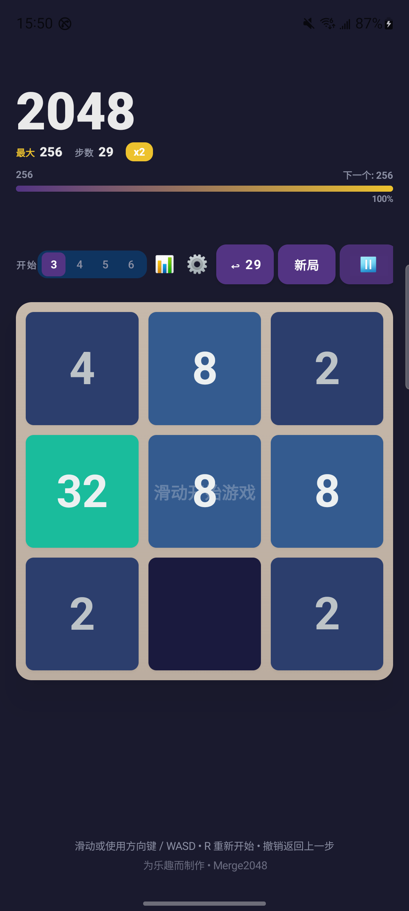
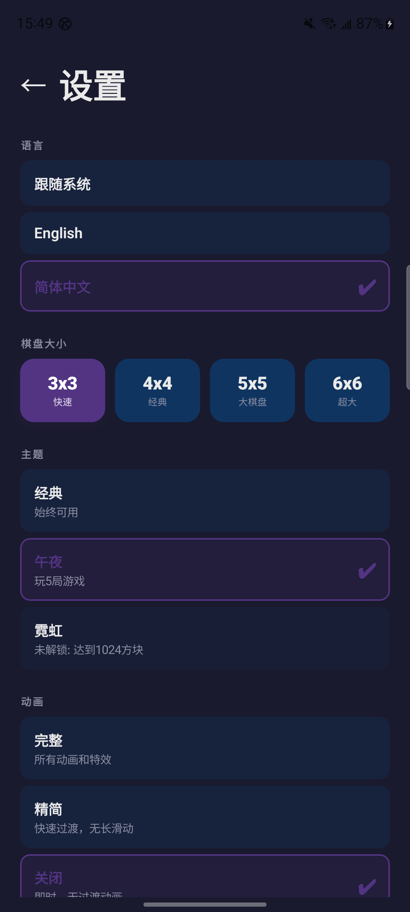
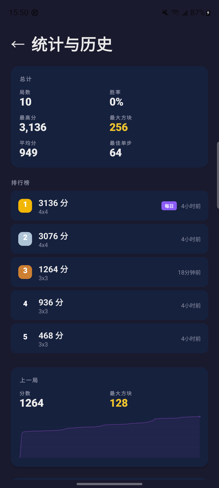
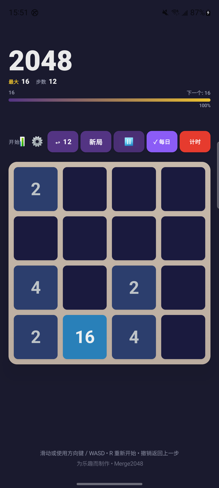
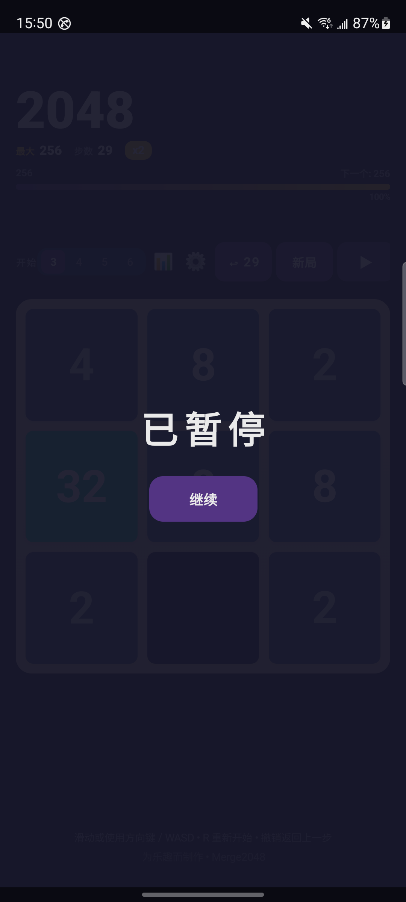
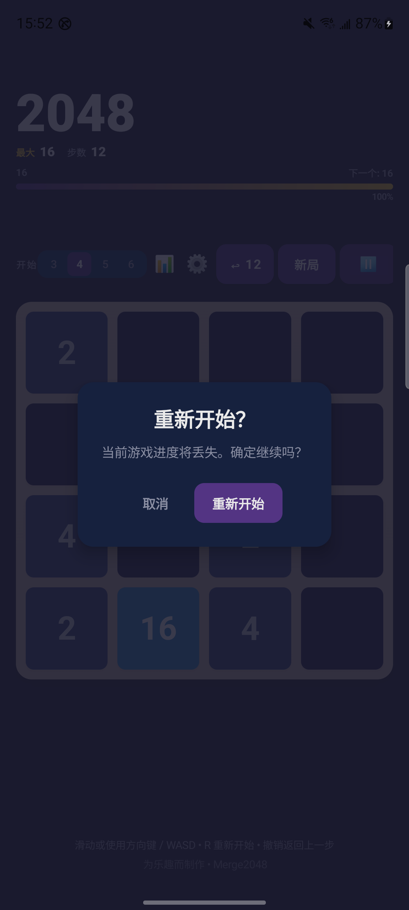
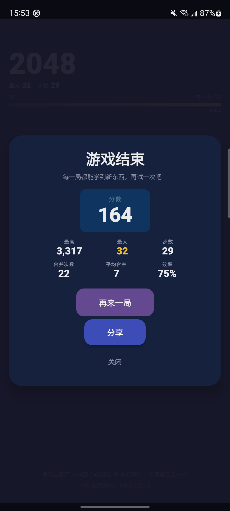

# Merge2048

A cross-platform **2048** puzzle game built with Kotlin Multiplatform + Compose Multiplatform (Material 3). Designed to feel and look like a polished, commercial-grade casual game. Fully localized in **English** and **Simplified Chinese** with in-app language switching.

## Platform support

| Platform | Status |
|----------|--------|
| Android | ✅ |
| iOS | ✅ |
| Desktop (JVM) | ✅ |
| Web (Wasm + JS) | ✅ |
| Server (Ktor) | ✅ |

## Screenshots

<p align="center">
  
  
  
  <br/>
  <small>First-launch tutorial · Classic gameplay · Dark mode</small>
</p>

<p align="center">
  
  
  
  <br/>
  <small>Settings · History & stats · Daily challenge</small>
</p>

<p align="center">
  
  
  
  <br/>
  <small>Pause dialog · Restart confirmation · Game-over summary</small>
</p>

## Features

**Gameplay**
- Classic 4x4 2048 rules with a full MVI state machine
- Custom board sizes: **3x3**, **4x4**, **5x5**, **6x6**
- **Undo** — step back one full move (`UNDO` button, only active when available)
- Score + **Best score** tracking with per-board-size bests (persisted between sessions)
- **Daily Challenge** — same seeded board for everyone every day, with a **dedicated per-day record** (highest score kept per day, shown on the history screen and via a ✓ on the Daily button once today's challenge is done)
- **Timed Challenge** — 60-second score-attack mode
- Win / game-over overlays with a full round summary (Score, Best, Max, Moves, Merges, Efficiency, Avg Merge) and motivational messages
- Full keyboard support on desktop/web: **arrow keys / WASD** to move, **R** to restart
- History records are tagged by mode (**Normal / Daily / Timer**) so every game's origin is visible

**Localization**
- **English** and **Simplified Chinese** (230 strings each, incl. game text, settings, achievements)
- **In-app language switching** — System default / English / 简体中文, persisted and applied at the framework level on Android

**Customization & settings**
- **Themes**: Classic, Dark, and Neon (Dark unlocks after 5 games, Neon at max tile 1024+) with fully recolored palettes
- **Dark mode** toggle (with system-follow fallback)
- **Animation level**: Full / Reduced / Off for accessibility
- **Sound effects** toggle
- Best-score and lifetime stats, achievement progress wall

**Achievements & progression**
- 20+ unlockable achievements (first N tile, merge chains, big boards, games/moves milestones)
- Achievement toasts in-game, celebration **confetti** on unlocks, and a full wall in Settings
- Goals and unlock requirements fully localized

**History & stats**
- Game history screen with **win rate**, lifetime aggregate stats, a per-game **score sparkline**, and a **DAILY CHALLENGES** card listing per-day results (Today / Yesterday / N days ago)

**Visual & interaction polish**
- Warm, classic 2048 color palette with premium gradients
- **Edge-to-edge** background that extends under the status bar and navigation bar (no light gaps, even in dark mode), with system bar icons synced to the in-app theme
- **Modal dialogs** for win / game-over / pause — full-screen scrim that blocks background buttons until dismissed
- Tile pop-in + merge pop animations, direction-aware board slide animation
- Floating score popups on merges, golden glow on high-value tiles (256+)
- First-launch **tutorial overlay**, animated score cards
- **Dark mode** toggle (with system-follow fallback); when enabled, every screen (game, settings, history) and their dialogs recolor instantly
- Responsive layout: content capped at 480dp, auto-adapts to landscape/short screens (compact header, progressive UI degradation), board scales to fit available space without overflow

**App icon**
- Custom-designed icon on every platform: Android adaptive + legacy mipmaps, iOS AppIcon, Desktop window/package icon, Web favicon

## Architecture

Strict layered MVI split into clean packages. Pure, cross-platform Kotlin domain types and
algorithms live in the **core** module — a Compose-free library that both the app (`app/shared`)
and the future online backend (`server`) share. The game engine and reducer layer run entirely on
this pure core and are fully JVM-testable (zero Compose/Android deps):

```
com.finley.android.merge2048
├── core/                # ★ Pure Kotlin domain library — zero Compose/Android deps, JVM-testable
│   └── domain/          # shared by the app and the future server (online mode)
│       ├── Direction.kt        # move direction enum
│       ├── TileMovement.kt     # per-tile animation descriptors
│       ├── GameState.kt        # immutable game snapshot
│       ├── GameIntent.kt       # user actions (sealed class)
│       ├── GameRecord.kt       # serializable per-game record (tagged by GameMode)
│       ├── GameSnapshot.kt     # serializable in-progress save payload
│       ├── DailyChallenge.kt   # date-seeded board generation + per-day DailyChallengeResult
│       ├── LifetimeStats.kt    # record aggregation for stats / leaderboards
│       └── UserPreferences.kt  # persisted settings (incl. language tag, daily results)
└── app/
    └── shared/src/commonMain/kotlin/com/finley/android/merge2048/
        ├── domain/             # engine + app-specific rules (depends on core)
        │   ├── GameEngine.kt       # game rules (board, moves, merges, undo, win/game-over)
        │   ├── GameReducer.kt      # ★ MVI heart: Intent → State reducer (owns best/win bookkeeping)
        │   ├── Achievement.kt      # achievement catalog (title/desc/emoji, localized)
        │   ├── AchievementEngine.kt# achievement detection & unlocking
        │   └── GameTheme.kt        # classic/dark/neon color themes + unlock rules
        ├── data/               # persistence & platform services (expect/actual)
        │   ├── SettingsRepository.kt   # JSON UserPreferences via multiplatform-settings
        │   ├── GameHistoryRepository.kt# serialized game records
        │   ├── GameRepository.kt
        │   ├── PlatformSettings.kt     # initPlatformStorage / createSettings (expect/actual)
        │   ├── LocaleHelper.kt         # setAppLocale(tag) (expect/actual)
        │   ├── SoundService.kt         # sound effects (expect/actual)
        │   ├── ShareService.kt         # share results (expect/actual)
        │   └── SystemBars.kt           # sync system bar icons to in-app dark mode (expect/actual)
        ├── presentation/
        │   ├── GameViewModel.kt    # thin shell: holds StateFlow, forwards intents to the reducer
        │   └── GameViewModelFactory.kt # expect/actual ViewModel retrieval (Android real ViewModel, others construct directly)
        └── ui/
            ├── navigation/AppNavigation.kt # sealed-class navigation (Game / Settings / History)
            ├── screen/GameScreen.kt        # screen assembly layer (no business logic)
            ├── screen/SwipeableGameBoard.kt# board grid + gesture/keyboard handling
            ├── theme/GameTheme.kt          # GameColors palette + font/score helpers
            ├── GameComponents.kt           # reusable design-system composables
            ├── GameOverSummary.kt          # win / game-over modal dialogs & summaries
            ├── SettingsScreen.kt           # settings screen
            ├── HistoryScreen.kt            # history + stats
            ├── AchievementComponents.kt    # achievement wall / toasts
            ├── ConfettiCelebration.kt      # unlock celebration
            ├── FloatingScore.kt, SparkLine.kt, TileProgressBar.kt, TutorialOverlay.kt
            └── App.kt               # root composable: platform context + navigation wiring
```

### Why a reducer?

All game behavior (move scoring, best-score tracking, win-dialog gating, achievement detection,
undo bookkeeping, state derivation) lives in the pure `GameReducer` (plus `AchievementEngine`).
The `GameViewModel` becomes a passive shell, and every state transition is unit-tested on the
JVM from `commonTest` without Android or Compose dependencies.

### The server module (planned online mode)

`server/` is currently a minimal Ktor scaffold. The intended use is an *online mode* on top of the
shared `core/domain` types: uploading/aggregating `GameRecord`s into leaderboards, validating daily-
challenge results via `DailyChallenge.dayFromSeed`, and powering cross-device sync — all reusing the
exact same serialized models as the app, so the two sides stay in lockstep.

## Persistence & platform services

- **Settings & records** persist via `multiplatform-settings` (SharedPreferences on
  Android, NSUserDefaults on iOS, file on JVM/JS/Wasm), serialized with kotlinx.serialization.
- **Language switching** uses `AppCompatDelegate.setApplicationLocales()` on Android
  (BCP 47 tags, `system`/`en`/`zh`); other platforms are no-ops that follow the OS locale.

## Project layout

- `app/androidApp/` — Android entry point + launcher resources + ProGuard rules
- `app/iosApp/` — iOS entry point + AppIcon assets
- `app/desktopApp/` — Desktop (JVM) entry point + window/package icon
- `app/webApp/` — Web entry point + favicon
- `app/shared/` — shared Compose Multiplatform UI, domain, and data code
- `core/` — code shared by all targets
- `server/` — Ktor server application

## Running the apps

- Android: `./gradlew :app:androidApp:assembleDebug`
- Desktop:
  - Hot reload: `./gradlew :app:desktopApp:hotRun --auto`
  - Standard run: `./gradlew :app:desktopApp:run`
- Web:
  - Wasm (faster, modern browsers): `./gradlew :app:webApp:wasmJsBrowserDevelopmentRun`
  - JS (older browser support): `./gradlew :app:webApp:jsBrowserDevelopmentRun`
- iOS: open `app/iosApp` in Xcode and run from there
- Server: `./gradlew :server:run`

## Running tests

- Shared JVM tests: `./gradlew :app:shared:jvmTest`
- Android host tests: `./gradlew :app:shared:testAndroidHostTest`
- Web: `./gradlew :app:shared:jsTest` / `./gradlew :app:shared:wasmJsTest`
- iOS: `./gradlew :app:shared:iosSimulatorArm64Test`
- Server: `./gradlew :server:test`

## Dependency version notes

| Dependency | Version | Rationale |
|---|---|---|
| `org.jetbrains.compose.material3` | **1.9.0** (stable) | Latest stable release. Versioning is decoupled from the Compose Multiplatform plugin; `1.11.0-alpha07` and similar alphas are pre-release tracks. The project only uses basic Material3 APIs (Button, Text, TextButton, ButtonDefaults) so no alpha features are needed. |
| `org.jetbrains.androidx.lifecycle` | **2.10.0** (stable) | The next stable release (`2.11.0`) requires AGP ≥ 9.1.0 and compileSdk ≥ 37, which this project's current toolchain does not yet support. `2.10.0` is the latest stable compatible with AGP 9.0.x / compileSdk 36. Upgrade AGP + compileSdk before adopting `2.11.0` stable. |

---

Learn more about [Kotlin Multiplatform](https://www.jetbrains.com/help/kotlin-multiplatform-dev/get-started.html),
[Compose Multiplatform](https://github.com/JetBrains/compose-multiplatform/#compose-multiplatform), and
[Kotlin/Wasm](https://kotl.in/wasm/).
